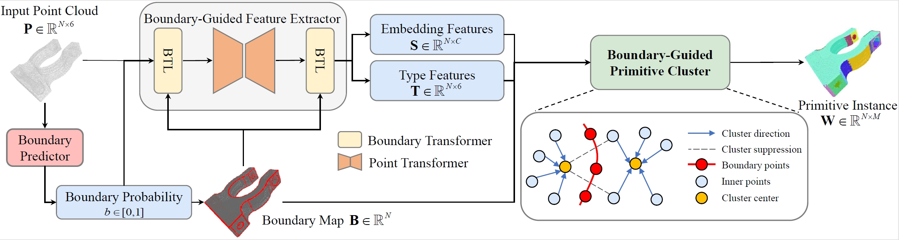

# BGPSeg

This is the repository for the paper "**BGPSeg: Boundary-Guided Primitive Instance Segmentation of Point Clouds**"

<div align="center">
  
</div>

## Installation

Requirements

- Python 3.8
- Pytorch 1.9.0 or higher
- CUDA 11.1 or higher

The following installation suppose `python=3.8`, `pytorch=1.9.0` and `cuda=11.1`.

- Create a conda virtual environment

  ```
  conda create -n bgpseg python=3.8
  conda activate bgpseg
  ```

- Install the dependencies

  Install [Pytorch 1.9.0](https://pytorch.org/)

  ```
  pip install -r requirements.txt
  ```

  ```
  cd lib/pointops && python setup.py install && cd ../../
  cd lib/boundaryops && python setup.py install && cd ../../
  cd lib/cpp && mkdir build && cd build && cmake .. -DCMAKE_BUILD_TYPE=Release && make -j8 && cd ../../../
  ```


## Dataset

ABCPrimitive Dataset is made by [PrimitiveNet](https://github.com/hjwdzh/PrimitiveNet). 

Please download the dataset from [here](https://drive.google.com/file/d/1wB4aeQD83efTmWEfMdH2F1YqCW15ngxL/view?usp=sharing) and put it under _data/ABCPrimitive_ folder.

## Pretrained Model

The pretrained model parameters are accessed in this [link](https://drive.google.com/drive/folders/1qev6yadvatGxGm-9HQBNiNIIpDNe9D1A?usp=sharing).

Move the pretrained model to checkpoints.

```
mkdir checkpoints
mv ${Download_PATH}/BGPSeg_model.pth ${Download_PATH}/Boundary_model.pth checkpoints/
```

## Usage

### Evaluating BGPSeg
```
sh tool/test.sh ABCPrimitive exp_name config/ABCPrimitive/ABCPrimitive.yaml
```
Predicted results will be saved in **exp/ABCPrimitive/test/exp_name/predictions**.

Evaluation for all metrics in paper will be saved in **exp/ABCPrimitive/test/exp_name/statistics**.

### Training BGPSeg
```
sh tool/train.sh ABCPrimitive exp_name config/ABCPrimitive/ABCPrimitive.yaml
```

## Citation

If you find this work useful in your research, please cite as below:

```
@article{fang2025bgpseg,
  title={BGPSeg: Boundary-Guided Primitive Instance Segmentation of Point Clouds},
  author={Fang, Zheng and Zhuang, Chuanqing and Lu, Zhengda and Wang, Yiqun and Liu, Lupeng and Xiao, Jun},
  journal={IEEE Transactions on Image Processing},
  year={2025},
  publisher={IEEE}
}
```

## Acknowledgements

Sincerely thanks for the following repositories: 
[ParSeNet](https://github.com/Hippogriff/parsenet-codebase), [HPNet](https://github.com/SimingYan/HPNet), [PrimitiveNet](https://github.com/hjwdzh/PrimitiveNet) and [Point Transformer](https://github.com/POSTECH-CVLab/point-transformer).